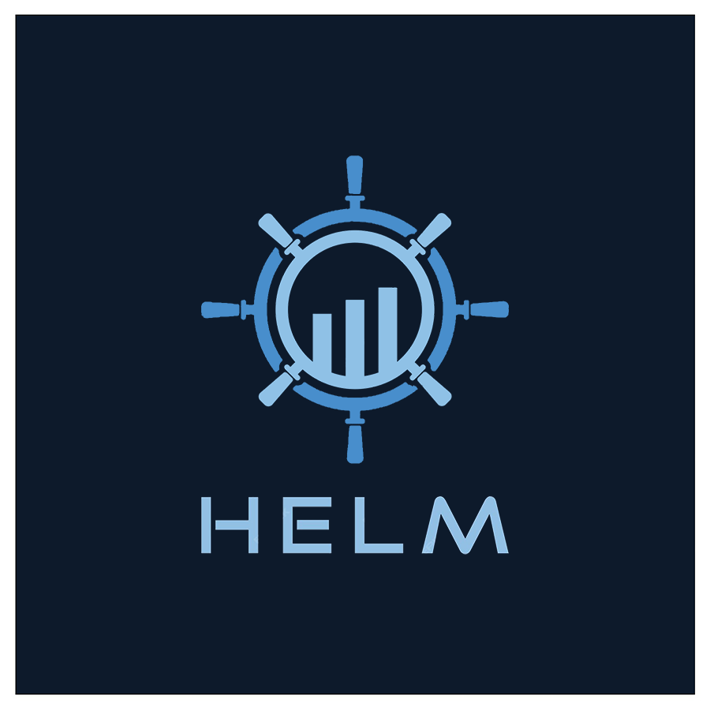
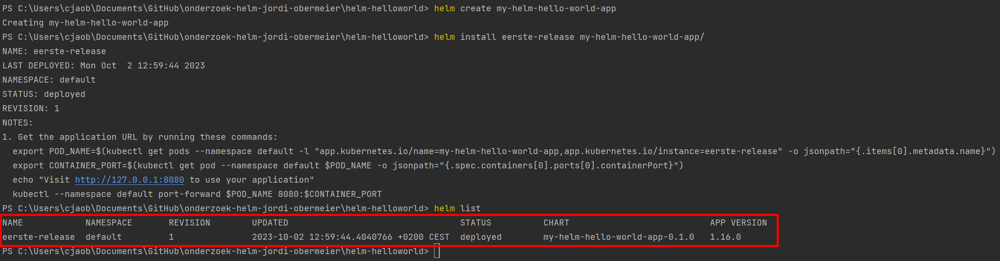
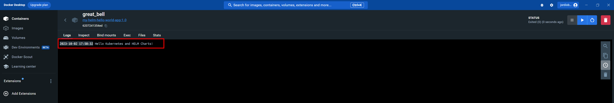

# Eenvoudig aan de slag met Kubernetes HELM Charts

Jordi Obermeier, 29 september 2023

---



Deze blog is de deliverable voor het onderzoek naar Helm Charts in Kubernetes. Er wordt onderzocht naar Helm Charts en de werking met betrekking tot Kubernetes. Gedurende de DevOps minor is er geleerd om eenvoudig applicaties te deployen naar een cloud-omgeving. Het containerizen van een applicatie was hierin de eerste stap met Docker. Kubernetes was de vervolgstap om meerdere containers te containerizen. Kubernetes vangt een hoop problemen op zoals het automatisch opnieuw opstarten van pods wanneer deze down gaan, het verdelen van de workload over de nodes/ pods en het onderling samenwerken/ communiceren van containers binnen de Kubernetes cluster. Kubernetes doet dit met behulp van de gemaakte `.yaml` bestanden.

De hoofdvraag luidt als volgt: "Hoe kunnen software developers met beperkte kennis van Kubernetes succesvol HELM Charts gebruiken voor het deployen van containerized applicaties?"

De deelvragen luiden als volgt:

1. _Wat zijn Kubernetes en HELM Charts, en waarom zijn ze relevant voor software developers?_
2. _Wat zijn de voordelen en nadelen van het gebruik van HELM Charts voor het beheren van Kubernetes-applicaties?_
3. _Hoe kan ik een bestaande HELM Chart vinden en gebruiken voor mijn specifieke toepassing?_
4. _Hoe kan ik monitoring en onderhoud uitvoeren voor applicaties die zijn geïmplementeerd met HELM Charts?_

<p style="text-align: right;"><i>Figuur 1: Logo combinatie van HELM en Kubernetes.</i></p>

## 1. Onderzoeksmethoden

Als ICT-student of -professional wordt er verwacht dat allerlei ICT-uitdagingen op te lossen zijn. Door het gebruik van de (verschillende) onderzoeksmethoden (Niels, 2022a) is het mogelijk snel antwoorden op vragen te krijgen en dus het probleem aan te pakken. Hieronder zijn de onderzoeksmethoden weergeven die gebruikt zijn tijdens dit onderzoeksverslag.

### 1.1 Literature study (Library)

Literature study wordt gebruikt om informatie over HELM Charts te vergaren op het internet. Hierbij zijn er bronnen gebruikt, waarbij in de tekst(en) vermeld wordt waar de informatie vandaan is gehaald (Niels, 2022b). Alle bronnen staan in de literatuurlijst.

### 1.2 Community research (Library)

Community research wordt gebruikt om oplossingen te bieden voor de problemen waar de gemeenschap ook tegen aanloopt over HELM Charts (Niels, 2018a). Hierbij worden meerdere bronnen bekeken om informatie te controleren op waarheden.

### 1.3 Problem analyses (Field)

Problem analyses wordt gebruikt om te definiëren van het "waarom" en "wat" van het onderzoek voordat er dieper ingegaan wordt op het "hoe" (de onderzoeksmethodologie). Het legt een basis voor de gehele onderzoeksinspanning en zorgt ervoor dat het onderzoek relevant en doelgericht is (Niels, 2018b).

### 1.4 Pitch (Showroom)

Pitch wordt gebruikt om uiteindelijk het onderzoek te presenteren. Naast het onderzoek presenteren is de feedback dat hieruit komt waardevol om het onderzoek te verbeteren en te bekijken of de HELM Charts een goed idee is voor een volgend project (Niels, 2018c).

### 1.5 Prototyping (Workshop)

Prototyping wordt gebruikt om snel en visueel te valideren of een concept of idee haalbaar is en om eventuele risico's te identificeren (Niels, 2018d). Er wordt dus een prototype gemaakt op basis van Kubernetes en de HEML Chart.

## 2. Onderzoeksresultaten

In het kopje onderzoek worden de deelvragen één voor één beantwoord met ChatGPT (OpenAI, 2021). Daarna wordt er per deelvraag één of meerdere relevante bronnen onderzocht voor verificatie.

### 2.1 Wat zijn Kubernetes en HELM Charts, en waarom zijn ze relevant voor software developers?

Kubernetes is een krachtig open-source containerorkestratieplatform dat is ontworpen om de implementatie, schaalbaarheid en het beheer van containerized applicaties te vereenvoudigen. Het fungeert als een geautomatiseerde beheerder van containerclusters, waardoor ontwikkelaars zich kunnen richten op het bouwen van applicaties zonder zich zorgen te hoeven maken over de onderliggende infrastructuur.

Helm is een krachtige package manager voor Kubernetes, vergelijkbaar met bekende tools zoals 'apt' voor Unix-systemen en 'pip' voor Python. Het stelt Kubernetes gebruikers in staat om softwaretoepassingen te installeren, upgraden en beheren, evenals de bijbehorende afhankelijkheden. Wat Helm bijzonder handig maakt, is dat het ook configuratieopties biedt voor softwaretoepassingen, waardoor het eenvoudiger wordt om ze te implementeren in een Kubernetes-cluster.

Helm-packages maken gebruik van wat we 'charts' noemen. Deze charts bevatten vaak .yaml configuratiebestanden en sjablonen voor Kubernetes manifesten. In de volgende sectie zullen we dieper ingaan op charts en hun bijbehorende templates, en laten we zien hoe Helm kan worden toegepast op concrete voorbeelden, zoals het implementeren van toepassingen in Kubernetes met behulp van charts en configuratieopties.

Kubernetes en Helm Charts zijn onmisbare tools voor moderne softwareontwikkelaars die containerized applicaties in een schaalbare, beheersbare en configureerbare omgeving willen implementeren en beheren. Ze verminderen de complexiteit van infrastructuurbeheer en stellen ontwikkelaars in staat zich te concentreren op het bouwen van hoogwaardige applicaties.

### 2.2 Wat zijn de voordelen en nadelen van het gebruik van HELM Charts voor het beheren van Kubernetes-applicaties?

Het gebruik van HELM Charts voor het beheren van Kubernetes-applicaties biedt verschillende voordelen en enkele potentiële nadelen.

**Voordelen van het gebruik van HELM Charts:**

- Herbruikbaarheid: HELM Charts bieden gestandaardiseerde sjablonen voor Kubernetes-resources. Dit maakt het gemakkelijk om dezelfde configuratie te hergebruiken voor verschillende toepassingen of omgevingen.
- Configuratiebeheer: HELM Charts laten ontwikkelaars configuratieopties definiëren en aanpassen voor hun toepassingen. Hierdoor kunnen parameters zoals poortnummers, wachtwoorden en omgevingsvariabelen worden aangepast zonder de broncode te wijzigen.
- Versiebeheer: HELM Charts kunnen worden geversioneerd, waardoor het eenvoudig is om oudere configuraties en releases bij te houden. Dit is handig voor rollbacks en auditing.
- Eenvoudige implementatie: Met HELM kunnen ontwikkelaars snel en eenvoudig toepassingen implementeren in Kubernetes clusters door simpelweg een HELM opdracht uit te voeren.
- Community en Ecosysteem: Er is een actieve gemeenschap van HELM gebruikers en ontwikkelaars die bijdragen aan een groeiend ecosysteem van beschikbare HELM Charts en plugins.
- Documentatie en best practices: HELM heeft uitgebreide documentatie en best practices die ontwikkelaars begeleiden bij het maken en beheren van HELM Charts.

**Nadelen en Uitdagingen bij het gebruik van HELM Charts:**

- Leercurve: Voor nieuwe gebruikers kan HELM enigszins complex lijken, vooral als ze niet vertrouwd zijn met Kubernetes concepten.
- Overhead voor Kleine Projecten: Voor kleine en eenvoudige projecten kan het opzetten van HELM Charts meer inspanning vergen dan handmatige configuratie.
- Compatibiliteit en Updates: HELM Charts moeten compatibel blijven met evoluerende Kubernetes versies en de bijbehorende API wijzigingen. Updates kunnen nodig zijn om Charts te blijven gebruiken met nieuwere Kubernetes versies.
- Veiligheidskwesties: Onjuist geconfigureerde HELM Charts kunnen veiligheidsrisico's met zich meebrengen. Het is belangrijk om beveiliging best practices te volgen bij het maken en gebruiken van Charts.
- Beheer van Afhankelijkheden: Als een Chart afhankelijkheden heeft, moeten deze correct worden beheerd en bijgewerkt om compatibiliteitsproblemen te voorkomen.
- Afhankelijkheid van de HELM gemeenschap: Bij het gebruik van HELM Charts vertrouw je op de gemeenschap om kwalitatieve en actuele Charts te produceren. Als een specifieke Chart niet wordt onderhouden, kan dit problemen veroorzaken.

Over het algemeen bieden HELM Charts aanzienlijke voordelen voor het beheren van Kubernetes applicaties, met name in complexe omgevingen waar herbruikbaarheid en configuratiebeheer belangrijk zijn. Het is echter essentieel om de leercurve te overwinnen en best practices te volgen om de nadelen te minimaliseren en de voordelen optimaal te benutten.

### 2.3 Hoe kan ik een bestaande HELM Chart vinden en gebruiken voor mijn specifieke toepassing?

Het vinden en gebruiken van een bestaande HELM Chart voor een specifieke toepassing is vrij eenvoudig. Hieronder zijn de stappen weergeven om dit te doen.

#### 1. Zoeken in Artifact HELM Repository of HELM CLI

De eerste stap is om te zoeken naar een bestaande HELM Chart die past bij de toepassing. HELM Charts worden vaak gedeeld en gepubliceerd in openbare repositories. De officiële HELM repository is [Artifact Hub](https://artifacthub.io/), waar veel HELM Charts te vinden zijn of gebruik de HELM CLI-opdracht `helm search` om naar HELM Charts te zoeken. Bijvoorbeeld:

```sh
helm search repo <zoekterm>
```

> NOTE: Vervang "zoekterm" door een trefwoord dat relevant is voor de toepassing.

#### 2. Selecteer een geschikte HELM Chart

Bekijk de zoekresultaten en selecteer een HELM Chart die geschikt lijkt voor de toepassing. Let op de beschrijving, versie en andere metagegevens om te beoordelen of het aan de gewenste behoeften voldoet.

#### 3. Installeer de HELM Chart

Nadat een geschikte HELM Chart gevonden is, kun deze worden geïnstalleerd met de `helm install` opdracht. Bijvoorbeeld:

```sh
helm install <release-naam> <repository/chart-naam>
```

> NOTE: Vervang "release-naam" door een naam voor de release en "repository/chart-naam" door de naam van de HELM Chart die geïnstalleerd moet worden.

#### 4. Pas configuratie aan (optioneel)

Als de standaardconfiguratie van de HELM Chart moet worden aangepast aan de specifieke toepassing, kan er een values.yaml bestand gemaakt of bewerkt worden. Vervolgens kan dit aan de `helm install` opdracht toegevoegd worden met de `--values-vlag`. Bijvoorbeeld:

```sh
helm install <release-naam> <repository/Chart-naam> --values values.yaml
```

#### 5. Controleer de status

Gebruik de `helm list` opdracht om de status van de releases te controleren en te zien of de installatie is geslaagd.

```sh
helm list
```

#### 6. Beheren van de releases

Nadat de HELM Chart geïnstalleerd is, kunnen de releases beheert worden met HELM opdrachten zoals [upgraden](https://helm.sh/docs/helm/helm_upgrade/), [verwijderen](https://helm.sh/docs/helm/helm_uninstall/) en [rollbacks](https://helm.sh/docs/helm/helm_rollback/) uitvoeren indien nodig.

### 2.4 Hoe kan ik monitoring en onderhoud uitvoeren voor applicaties die zijn geïmplementeerd met HELM Charts?

Monitoring en onderhoud van applicaties die zijn geïmplementeerd met HELM Charts zijn essentieel om ervoor te zorgen dat toepassingen soepel blijven werken en om eventuele problemen snel op te lossen. Hieronder zijn stappen weergeven die gevolgd kunnen worden om monitoring en onderhoud uit te voeren.

#### 01. Implementeer monitoring tools

Gebruik tools zoals Prometheus en Grafana om monitoring en observatie in te stellen voor Kubernetes-cluster en applicaties. HELM Charts zijn beschikbaar voor deze tools om de installatie te vereenvoudigen.

#### 02. Configureer monitoring voor applicaties

Binnen een HELM Chart kunnen specifieke instellingen geconfigureerd worden om metrische gegevens te genereren en te exporteren, bijvoorbeeld met Prometheus exporters. Zorg ervoor dat de applicaties die geïmplementeerd zijn, metrische gegevens genereren die relevant zijn voor de prestaties en status van de toepassing.

#### 03. Maak aangepaste dashboards

Maak aangepaste dashboards in bijvoorbeeld Grafana om belangrijke metrische gegevens te visualiseren. Hierdoor kunnen snel problemen geïdentificeerd en trends (observeren en analyseren) gevolgd worden.

#### 04. Stel waarschuwingen in

Configureer waarschuwingen in Prometheus of Grafana op basis van de metrische gegevens. Dit stelt in staat om proactief te reageren op problemen voordat ze kritiek worden.

#### 05. Voer regelmatig onderhoud uit

Voer regelmatig onderhoud uit voor zowel de Kubernetes-cluster als de applicaties zelf. Dit omvat het bijwerken van HELM Charts, Kubernetes en applicatiecontainers naar de nieuwste versies.

#### 06. Maak back-ups

Maak regelmatig back-ups van de configuratie van de HELM releases en applicatiegegevens. Dit is vooral belangrijk als wijzigingen aangebracht worden in de configuratie.

#### 07. Automatiseer Taken

Automatiseer taken zoals het opschonen van oude resources, het bijwerken van HELM releases en het herstarten van pods indien nodig.

#### 08. Implementeer CI/CD-pijplijnen

Gebruik Continuous Integration/Continuous Deployment (CI/CD) pipelines om automatisch nieuwe versies van applicaties uit te rollen en ervoor te zorgen dat HELM Charts up-to-date blijven.

#### 09. Documenteer Processen

Documenteer monitoring- en onderhoudsprocessen, zodat het team begrijpt hoe te handelen in geval van problemen.

#### 10. Leer van Incidenten

Evalueer incidenten en problemen om te begrijpen wat er is gebeurd en hoe soortgelijke problemen in de toekomst voorkomen kunnen worden.

&nbsp;

Kortom, het monitoren en onderhouden van applicaties in Kubernetes met HELM Charts is een doorlopend proces. Het vereist aandacht voor detail en proactieve betrokkenheid om de betrouwbaarheid en prestaties van applicaties te waarborgen. Het opzetten van een solide monitoring- en onderhoudsinfrastructuur is van cruciaal belang voor succesvolle Kubernetes implementaties.

## 3. Prototype met Java, Docker, Kubernetes en HELM

Nu de deelvragen beantwoord zijn (theorie), is het tijd om met de informatie een prototype te maken (praktijk). Het prototype wordt gemaakt in Java met Docker (Kubernetes) en met HELM.

### 01. Vereisten

Zorg ervoor dat de volgende vereisten geïnstalleerd zijn:

- [IntelliJ IDEA](https://www.jetbrains.com/idea/download/?section=windows) of een andere IDE
- [Docker Desktop (met Kubernetes)](https://docs.docker.com/desktop/kubernetes/)
- [Helm (geïnstalleerd en geconfigureerd)](https://helm.sh/docs/intro/install/)

### 02. Een eenvoudige Java-toepassing maken

Maak een nieuw leeg mapje voor je project. Maak vervolgens een eenvoudige Java klasse aan met de naam `HelloWorld.java` met de volgende inhoud:

```Java
public class HelloWorld {
    public static void main(String[] args) {
        System.out.println("Hello Kubernetes and HELM Charts!");
    }
}
```

### 03. Aanmaken Dockerfile

Maak een `Dockerfile` in dezelfde map als je `HelloWorld.java` bestand met de volgende inhoud:

```Dockerfile
# Gebruik een OpenJDK-base image
FROM openjdk:20-jdk-slim

# Voeg de Java applicatie toe aan de container
COPY HelloWorld.java /app/HelloWorld.java

# Compileer de Java applicatie
WORKDIR /app
RUN javac HelloWorld.java

# Voer de Java applicatie uit
CMD ["java", "HelloWorld"]
```

### 04. Bouw Docker image

Open een terminal, navigeer naar de map waarin je `Dockerfile` en `HelloWorld.java` zich bevinden en voer het volgende Docker opdracht uit om de Docker image te bouwen:

```sh
docker build -t my-helm-hello-world-app:1.0 .
```

Dit bouwt een Docker image met de naam "my-helm-hello-world-app" en de tag "1.0" op basis van je Dockerfile en Java code.

### 05. Aanmaken HELM Chart

Maak nu een HELM Chart voor de Java toepassing met de `helm create` opdracht:

```sh
helm create my-helm-hello-world-app
```

Als de `helm create` opdracht geen fouten weergeeft ziet de structuur er nu zo uit:

  
_Figuur 2: De structuur van de HELM Chart._

### 06. Definieer de toepassing in de HELM Chart

Bewerk het values.yaml bestand binnen de HELM Chart om de configuratie van de toepassing en Docker image te definiëren.

```yaml
image:
  repository: my-helm-hello-world-app
  tag: 1.0
```

### 07. Creëer Kubernetesbronnen

Binnen de "templates/" directory van de Chart kunnen YAML-bestanden gemaakt worden om Kubernetesbronnen te definiëren, zoals deployments, services, configMaps, et cetera. Pas deze bestanden aan om de toepassing te beschrijven. Hieronder is een voorbeeld weergeven van een `deployment.yaml` bestand binnen de "templates/" directory.

```yaml
apiVersion: apps/v1
kind: Deployment
metadata:
  name: {{ include "my-helm-hello-world-app.fullname" . }}
  labels:
    {{- include "my-helm-hello-world-app.labels" . | nindent 4 }}
spec:
  replicas: {{ .Values.replicaCount }}
  selector:
    matchLabels:
      {{- include "my-helm-hello-world-app.selectorLabels" . | nindent 6 }}
  template:
    metadata:
      labels:
        {{- include "my-helm-hello-world-app.selectorLabels" . | nindent 8 }}
    spec:
      containers:
        - name: {{ .Chart.Name }}
          image: "{{ .Values.image.repository }}:{{ .Values.image.tag }}"
```

### 08. Installeer HELM Chart

Gebruik de `helm install` opdracht om de HELM Chart in de Kubernetes cluster te installeren.

```sh
helm install <my-java-release> <my-helm-hello-world-app/>
```

> NOTE: Vervang "my-java-release" door een naam voor de release en "my-java-app/" door het pad naar de HELM Chart directory.

### 09. Controleer de status

Gebruik de `helm list` opdracht om te controleren of de release is geïnstalleerd en bekijk de status ervan. Dit ziet er zo uit:

  
_Figuur 3: De HELM is succesvol aangemaakt en geïnstalleerd._

### 10. Applicatie met HELM werkt

De output van de console komt overeen met wat er in de code van `HelloWorld.java` staat.

  
_Figuur 4: De console output komt overeen met de `HelloWorld.java` code._

## 4. Conclusie

Dit onderzoek heeft zich gericht op de hoofdvraag: "Hoe kunnen software developers met beperkte kennis van Kubernetes succesvol HELM Charts gebruiken voor het deployen van containerized applicaties?" De antwoorden op deze vraag zijn gebaseerd op gedetailleerd onderzoek naar Kubernetes, HELM Charts en de praktische toepassing ervan.

Kubernetes is een krachtig containerorkestratieplatform dat containerized applicaties schaalbaar en beheersbaar maakt. HELM is een package manager voor Kubernetes die softwareontwikkelaars in staat stelt om applicaties te installeren, configureren en beheren met behulp van HELM Charts, die sjablonen en configuratieopties bevatten. Het gebruik van HELM Charts biedt tal van voordelen, waaronder herbruikbaarheid, configuratiebeheer, versiebeheer, eenvoudige implementatie en een groeiende gemeenschap. Deze voordelen maken het aantrekkelijk voor ontwikkelaars om HELM Charts te gebruiken, zelfs met beperkte Kubernetes-kennis. Er zijn echter ook uitdagingen verbonden aan het gebruik van HELM Charts, zoals de leercurve voor beginners, potentiële overhead voor kleine projecten en de noodzaak om compatibiliteit en beveiliging te waarborgen. Voor software developers zijn de stappen beschikbaar in hoofdstuk "3. Prototype met Java, Docker, Kubernetes en HELM" om met succes HELM Charts te gebruiken voor het implementeren van containerized applicaties.

Kortom, met de juiste stappen en hulpbronnen kunnen software developers met beperkte Kubernetes kennis met succes HELM Charts gebruiken voor het implementeren van containerized applicaties. Dit stelt hen in staat om complexe Kubernetes implementaties te vereenvoudigen en zich te concentreren op het bouwen van hoogwaardige applicaties.

## Literatuurlijst

- OpenAI. (2021). ChatGPT. Geraadpleegd op 29 september 2023, van [https://openai.com/research/chatgpt](https://openai.com/research/chatgpt)
- AIM Professional Skills. (2014, 1 juli). Controlekaart documenten ICA. Geraadpleegd op 22-9-2023 op [https://factlearning.files.wordpress.com/2016/02/controlekaart-documenten-ica.pdf](https://factlearning.files.wordpress.com/2016/02/controlekaart-documenten-ica.pdf).
- Niels, R. (2022a, 10 juni). _Methods_.  ICT Research Method. Geraadpleegd op 29 september 2023, van [https://ictresearchmethods.nl/Methods](https://ictresearchmethods.nl/Methods)
- Niels, R. (2022b, 24 mei). _Literature study_.  ICT Research Method. Geraadpleegd op 29 september 2023, van [https://ictresearchmethods.nl/Literature_study](https://ictresearchmethods.nl/Literature_study)
- Niels, R. (2018a, 9 februari). _Community research_.  ICT Research Method. Geraadpleegd op 29 september 2023, van [https://ictresearchmethods.nl/Community_research](https://ictresearchmethods.nl/Community_research)
- Niels, R. (2018b, 9 februari). _Problem analysis_.  ICT Research Method. Geraadpleegd op 29 september 2023, van [https://ictresearchmethods.nl/Problem_analysis](https://ictresearchmethods.nl/Problem_analysis)
- Niels, R. (2018c, 9 februari). _Pitch_.  ICT Research Method. Geraadpleegd op 29 september 2023, van [https://ictresearchmethods.nl/Pitch](https://ictresearchmethods.nl/Pitch)
- Niels, R. (2018d, 9 februari). _Prototyping_.  ICT Research Method. Geraadpleegd op 29 september 2023, van [https://ictresearchmethods.nl/Prototyping](https://ictresearchmethods.nl/Prototyping)
- Bron per deelvraag..
